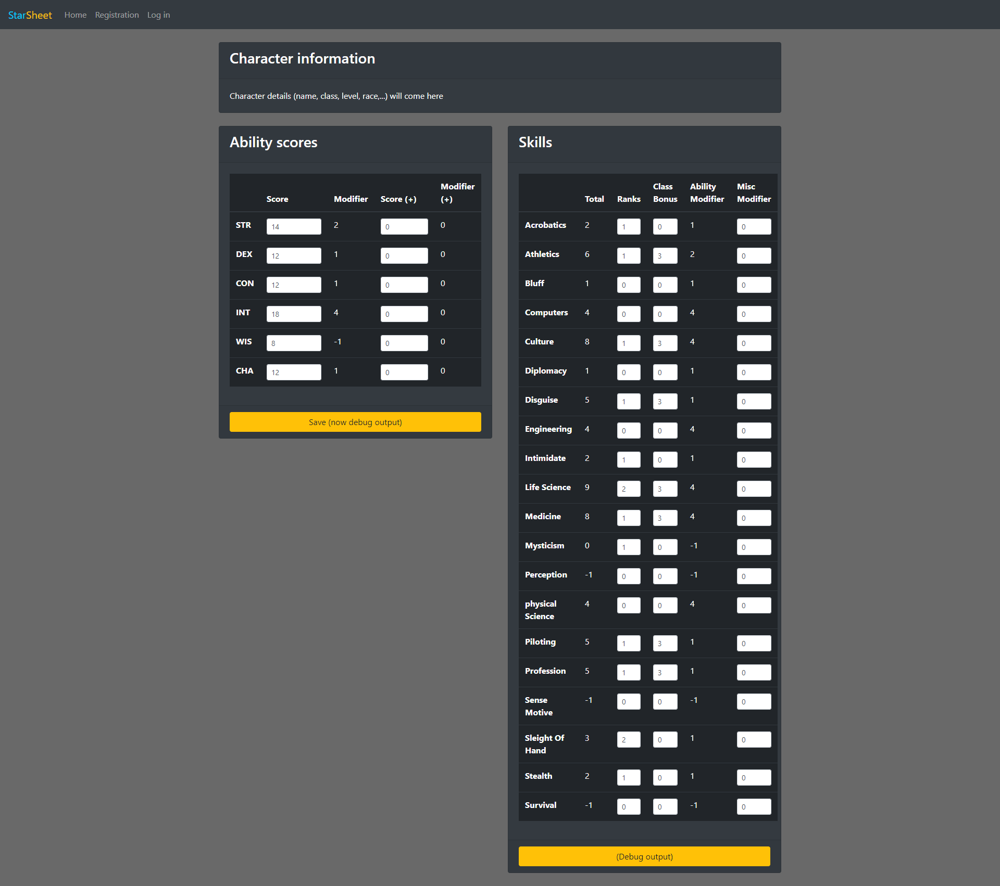

 # StarSheet
 
 A Starfinder character sheet creator and manager
 
 Inline-style: 
 

 ## Usage

- For the **frontend**: read the [README.md](starsheet-frontend/README.md) in `startsheet-frontend`
- For the **backend**: To be developed

## Quick Todo's
- [ ] Total in Skills is only recalculated after input field changes (not when the modifiers are altered)
- [ ] Search for 2 Todo's in the code
    - One in `sheet-detail-ability-scores.component.ts`
    - The other in `sheet-detail-skills.component.ts`

## Todo's frontend
- [X] Create Log in and Register screens (Html, Css)  
- [X] Create a Splash screen (Html, Css)  
- [X] Implement Log in functionality (Dummy)
- [X] Implement Register functionality (Dummy)

### Functional requirements
- [ ] Character main information (name, class, race, theme, size, speed,...)
- [X] Ability scores
- [ ] Initiative
- [ ] Health and Resolve
- [X] Skills
- [ ] Armor class
- [ ] Saving throws
- [ ] Attack bonuses
- [ ] Weapons
- [ ] ...